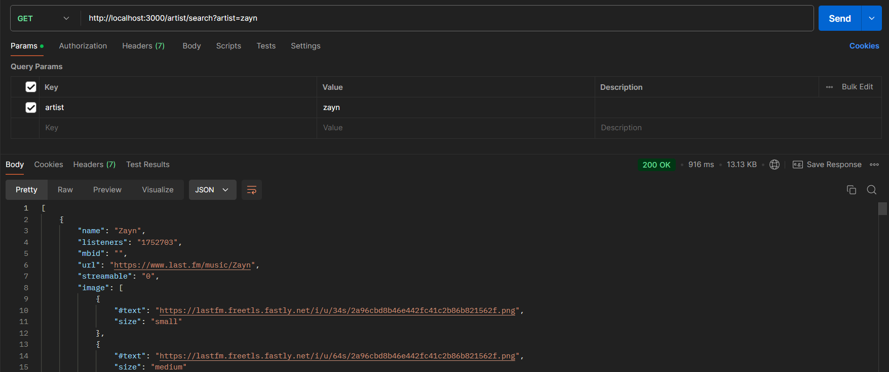
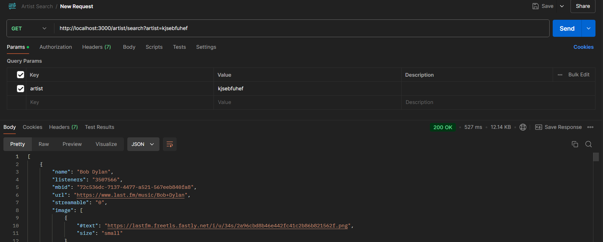
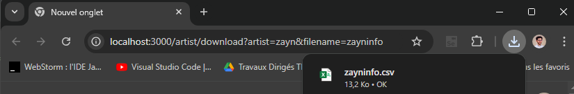

## Project Description

SEARCH.ARTIST is a Node.js application built with Express and TypeScript, designed to allow users to search for artists using the Last.fm API and downloading the results in a csv file 


The application exposes three key APIs:

1. **Search Artist**

    - **Endpoint:** `artist/search`
    - **Description:** Retrieve information on specific artists by name. The request accepts parameters such as artist name, limit, and page number ( default values for limi and page are 20 and 1 ). If the Last.fm API does not return any results, fallback data from a JSON file ( fallbackArtists.json ) is provided.
      here is an example of the api call with a valid artist name : 
      
      example of when no data found for the specified name and a random artist name is generated : 
      


3. **Download Artist CSV**

    - **Endpoint:** `/artist/Download`
    - **Description:** Performs a similar search to the artist search API but downloads the results in a csv file , the request accepts same parameters as search with a new one filename which is the name of the csv file that will be downloaded ( default value = artist_search.csv )
      
   

## Installation Steps

To get the project running locally:

1. **Clone the repository:**
   ```bash
   git clone <repository_url>
   ```

2. **Install dependencies:**
   ```bash
   npm install
   ```

3. **Set environment variables:**
    - Create your `.env` file and put necessary infos (API_KEY ,PORT)


4. **Start the application in development mode:**
   ```bash
   npm run dev
   ```


## Contact Information

For any questions or issues, feel free to reach out to the project maintainer: **Email**: mohamed.lassoued@insat.ucar.tn
